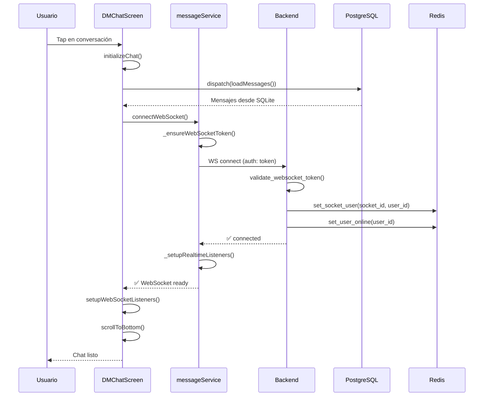
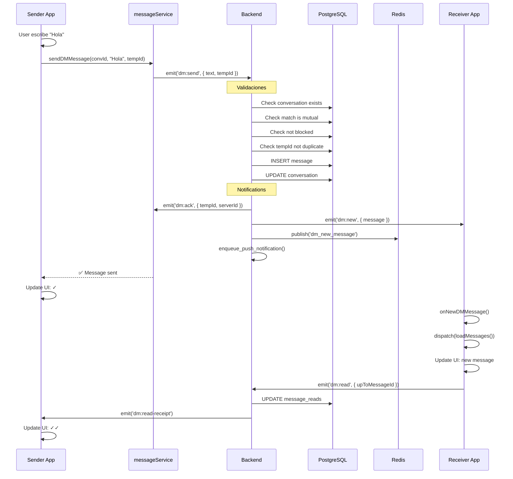
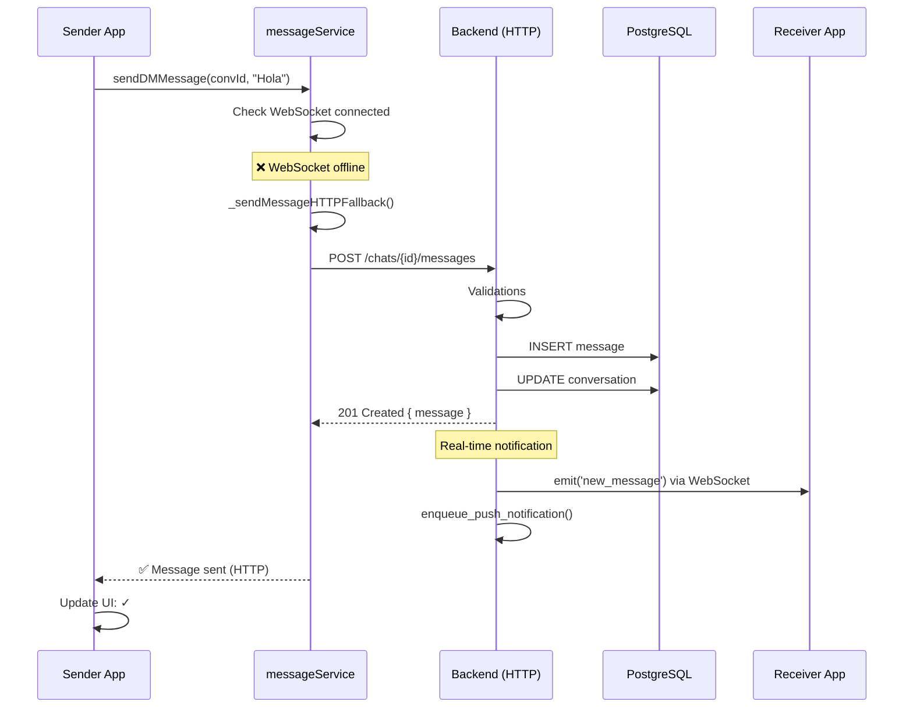

# 📨 Análisis Completo del Flujo de Mensajería (Chat/DM)

## 📑 Índice
1. [Arquitectura General](#arquitectura-general)
2. [Base de Datos - Modelos](#base-de-datos---modelos)
3. [Backend - Rutas HTTP](#backend---rutas-http)
4. [Backend - Socket.IO (WebSocket)](#backend---socketio-websocket)
5. [Mobile - Servicios](#mobile---servicios)
6. [Mobile - UI (DMChatScreen)](#mobile---ui-dmchatscreen)
7. [Flujo Completo: Enviar un Mensaje](#flujo-completo-enviar-un-mensaje)
8. [Flujo Completo: Recibir un Mensaje](#flujo-completo-recibir-un-mensaje)
9. [Funcionalidades Adicionales](#funcionalidades-adicionales)
10. [Diagramas de Secuencia](#diagramas-de-secuencia)

---

## 🏗️ Arquitectura General

### **Arquitectura Híbrida: WebSocket + HTTP REST**

Tu aplicación implementa una **arquitectura híbrida inteligente** que combina lo mejor de dos mundos:

```
┌─────────────────────────────────────────────────────────────┐
│                    MOBILE APP (React Native)                │
│                                                             │
│  ┌─────────────┐        ┌──────────────────────────────┐  │
│  │ DMChatScreen│───────▶│  messageService              │  │
│  │  (UI)       │        │  - HTTP REST (historial)     │  │
│  └─────────────┘        │  - WebSocket (real-time)     │  │
│                         │  - Fallback automático       │  │
│                         └──────────────────────────────┘  │
│                                    │                        │
└────────────────────────────────────┼────────────────────────┘
                                     │
                    ┌────────────────┴────────────────┐
                    │                                  │
              ┌─────▼─────┐                   ┌───────▼────────┐
              │ HTTP REST │                   │   WebSocket    │
              │   :5000   │                   │ Socket.IO :5000│
              └─────┬─────┘                   └───────┬────────┘
                    │                                  │
┌───────────────────┴──────────────────────────────────┴────────┐
│                    BACKEND (Flask + Socket.IO)                │
│                                                                │
│  ┌──────────────────┐    ┌─────────────┐    ┌─────────────┐ │
│  │  messages.py     │───▶│   Models    │◀───│  Socket.IO  │ │
│  │  (HTTP routes)   │    │ - Message   │    │  Handlers   │ │
│  │                  │    │ - Conversation│   │             │ │
│  │  GET /messages   │    │ - MessageRead│   │ dm:send     │ │
│  │  POST /messages  │    │ - UserBlock │    │ dm:join     │ │
│  │  GET /convs      │    └─────────────┘    │ dm:typing   │ │
│  └──────────────────┘            │           └─────────────┘ │
│                                   │                           │
│                         ┌─────────▼──────────┐               │
│                         │   PostgreSQL DB    │               │
│                         │  - conversations   │               │
│                         │  - messages        │               │
│                         │  - message_reads   │               │
│                         └────────────────────┘               │
└─────────────────────────────────────────────────────────────┘
```

### **¿Cuándo se usa cada protocolo?**

| Operación | Protocolo | ¿Por qué? |
|-----------|-----------|-----------|
| **Enviar mensaje** | WebSocket (con HTTP fallback) | Latencia < 50ms, bidireccional, confirmación inmediata |
| **Recibir mensaje** | WebSocket | Notificación instantánea en tiempo real |
| **Cargar historial** | HTTP REST | Paginación eficiente, cache, CDN-friendly |
| **Typing indicators** | WebSocket | Tiempo real, efímero (no se guarda) |
| **Read receipts** | WebSocket | Actualización instantánea bilateral |
| **Lista de conversaciones** | HTTP REST | Paginación cursor-based, filtrado |

---

## 📊 Base de Datos - Modelos

### **1. Modelo: `Conversation` (conversations)**
📍 **Ubicación**: `backend/app/models/message.py:167-269`

```python
# FLUJO: Este modelo representa una conversación 1:1 entre dos usuarios
# Se crea automáticamente cuando hay un match mutuo
```

**Campos clave:**
- `id` (PK): ID autoincremental de la conversación
- `user1_id`, `user2_id`: Los dos participantes (user1_id < user2_id siempre)
- `last_message_id`: ULID del último mensaje enviado
- `last_message_at`: Timestamp del último mensaje (para ordenar conversaciones)
- `current_key_version`: Para E2EE (encriptación end-to-end)

**Métodos importantes:**
```python
# 📍 backend/app/models/message.py:233-253
@classmethod
def get_or_create_conversation(cls, user1_id, user2_id):
    """
    FLUJO PASO 1: Cuando hay un match mutuo, aquí se crea/obtiene la conversación
    - Garantiza que solo existe UNA conversación por par de usuarios
    - Ordena los IDs (user1_id < user2_id) para unicidad
    """
```

---

### **2. Modelo: `Message` (messages)**
📍 **Ubicación**: `backend/app/models/message.py:8-166`

```python
# FLUJO: Este es el corazón del sistema - cada mensaje enviado es una fila aquí
# Usa ULIDs (como UUID pero ordenables) para el ID
```

**Campos clave:**
- `id` (PK VARCHAR(26)): ULID generado con `generate_message_id()`
- `conversation_id`: FK a `conversations`
- `sender_id`: Quién envió el mensaje
- `receiver_id`: Quién lo recibe (para compatibilidad)
- `text`: Contenido del mensaje (hasta 4096 bytes)
- `client_temp_id`: ID temporal del cliente (para idempotencia)
- `is_read`: Si fue leído
- `created_at`: Timestamp de creación (para ordenamiento)

**Campos E2EE (futuro):**
- `ciphertext`, `nonce`, `tag`, `key_version`, `algorithm`: Para mensajes cifrados

**Métodos importantes:**
```python
# 📍 backend/app/models/message.py:113-136
@classmethod
def get_conversation_messages(cls, conversation_id, limit=50, before_id=None):
    """
    FLUJO: Al abrir un chat, este método obtiene el historial de mensajes
    - Soporta paginación con cursor (before_id)
    - Ordena por ID (ULID) que es cronológicamente ordenable
    """
```

---

### **3. Modelo: `MessageRead` (message_reads)**
📍 **Ubicación**: `backend/app/models/message.py:272-334`

```python
# FLUJO: Sistema de "watermark" - marca hasta qué mensaje has leído
# Es más eficiente que marcar cada mensaje individual
```

**Campos clave:**
- `conversation_id` + `user_id`: PK compuesta
- `up_to_message_id`: ULID del último mensaje leído
- `updated_at`: Timestamp de última actualización

**Métodos importantes:**
```python
# 📍 backend/app/models/message.py:291-309
@classmethod
def update_read_watermark(cls, conversation_id, user_id, message_id):
    """
    FLUJO: Cuando lees mensajes, se actualiza este "watermark"
    - En lugar de marcar 50 mensajes como leídos, solo guardas el último ID
    - Mucho más eficiente para consultas
    """
```

---

### **4. Modelo: `UserBlock` (user_blocks)**
📍 **Ubicación**: `backend/app/models/message.py:336-383`

```python
# FLUJO: Bloqueos entre usuarios - previene spam y acoso
# Se valida en CADA evento de mensajería
```

**Validación en cada operación:**
```python
# 📍 backend/app/models/message.py:353-360
@classmethod
def is_blocked(cls, user_id, other_user_id):
    """
    FLUJO: Antes de enviar/recibir mensaje, se valida si hay bloqueo
    - Si A bloqueó a B, B no puede enviarle mensajes
    - Si B bloqueó a A, A no puede enviarle mensajes
    """
```

---

## 🌐 Backend - Rutas HTTP

### **Ruta 1: GET /api/v1/messages/conversations**
📍 **Ubicación**: `backend/app/routes/messages.py:29-188`

```python
# ════════════════════════════════════════════════════════════
# FLUJO INICIAL: Pantalla de lista de chats
# ════════════════════════════════════════════════════════════
# 1. Usuario abre la app
# 2. App mobile hace GET /conversations
# 3. Backend devuelve lista paginada de conversaciones
# 4. Mobile muestra lista de chats con último mensaje y unread count
```

**Flujo paso a paso:**
```python
# PASO 1: Validar autenticación
@login_required  # 📍 messages.py:30
# ▶️ Verifica JWT del usuario

# PASO 2: Obtener parámetros de paginación
limit = min(int(request.args.get('limit', 20)), 50)  # 📍 messages.py:58
cursor = request.args.get('cursor')  # Timestamp del último item cargado

# PASO 3: Query de conversaciones del usuario
query = Conversation.query.filter(
    or_(
        Conversation.user1_id == request.current_user_id,
        Conversation.user2_id == request.current_user_id
    ),
    Conversation.is_deleted == False
).order_by(Conversation.last_message_at.desc().nullslast())  # 📍 messages.py:62-69
# ▶️ Obtiene conversaciones donde el usuario participa
# ▶️ Ordena por último mensaje (más reciente primero)

# PASO 4: Aplicar cursor pagination
if cursor:
    cursor_dt = datetime.fromisoformat(cursor)
    query = query.filter(Conversation.last_message_at < cursor_dt)  # 📍 messages.py:72-77
# ▶️ Paginación eficiente sin OFFSET

# PASO 5: Batch loading de usuarios (optimización)
user_ids = [...]
users = User.query.filter(User.id.in_(user_ids)).all()  # 📍 messages.py:100-109
# ▶️ Una sola query para todos los usuarios (evita N+1)

# PASO 6: Para cada conversación
for conv in conversations:
    # PASO 6.1: Obtener el otro usuario
    other_user_id = conv.user2_id if conv.user1_id == current_user else conv.user1_id

    # PASO 6.2: Verificar match mutuo (REQUERIMIENTO DM)
    has_match = Match.query.filter(
        Match.user_id == current_user_id,
        Match.matched_user_id == other_user_id,
        Match.is_mutual == True
    ).first() is not None  # 📍 messages.py:133-137
    # ▶️ CRÍTICO: Solo muestra conversaciones con match activo

    if not has_match:
        continue  # Skip esta conversación

    # PASO 6.3: Obtener unread count (con watermark)
    unread_count = MessageRead.get_unread_count(conv.id, current_user_id)  # 📍 messages.py:130
    # ▶️ Cuenta mensajes después del watermark

    # PASO 6.4: Check online status (desde Redis)
    is_online = redis_client.is_user_online(other_user_id)  # 📍 messages.py:120
    # ▶️ Consulta rápida a Redis (no DB)

    # PASO 6.5: Armar objeto de conversación
    conv_data = {
        'chat_id': conv.id,
        'user': {
            'id': other_user.id,
            'nickname': other_user.nickname,
            'avatar': other_user.avatar_url,
            'is_online': is_online
        },
        'last_message': last_message,
        'last_message_time': conv.last_message_at.isoformat(),
        'unread': unread_count
    }  # 📍 messages.py:143-154

# PASO 7: Retornar respuesta paginada
return jsonify({
    'conversations': conv_list,
    'pagination': {
        'next_cursor': next_cursor,  # Para cargar más
        'has_more': has_more,
        'total': len(conv_list),
        'limit': limit
    }
}), 200  # 📍 messages.py:157-165
```

---

### **Ruta 2: GET /api/v1/messages/chats/:chat_id/messages**
📍 **Ubicación**: `backend/app/routes/messages.py:190-269`

```python
# ════════════════════════════════════════════════════════════
# FLUJO: Cargar historial de mensajes al abrir un chat
# ════════════════════════════════════════════════════════════
# 1. Usuario hace tap en una conversación
# 2. App mobile hace GET /chats/{chat_id}/messages
# 3. Backend devuelve mensajes paginados
# 4. Mobile muestra historial y marca como leído
```

**Flujo paso a paso:**
```python
# PASO 1: Validar conversación existe
conversation = Conversation.query.get(chat_id)  # 📍 messages.py:198
if not conversation or conversation.is_deleted:
    return 404  # Conversación no encontrada

# PASO 2: Validar que el usuario es miembro
if not conversation.has_user(request.current_user_id):  # 📍 messages.py:202
    return 403  # No autorizado
# ▶️ Verifica que user_id == user1_id OR user_id == user2_id

# PASO 3: Obtener el otro usuario
other_user_id = conversation.get_other_user_id(request.current_user_id)  # 📍 messages.py:206

# PASO 4: Validar match mutuo activo (CRÍTICO)
has_match = Match.query.filter(
    Match.user_id == request.current_user_id,
    Match.matched_user_id == other_user_id,
    Match.is_mutual == True
).first() is not None  # 📍 messages.py:209-213

if not has_match:
    return 403  # Sin match, sin mensajería

# PASO 5: Verificar que no hay bloqueos
if UserBlock.is_blocked(request.current_user_id, other_user_id):  # 📍 messages.py:219
    return 403  # Usuario bloqueado

# PASO 6: Obtener mensajes con paginación (cursor-based)
before_id = request.args.get('before')  # ULID del último mensaje cargado
limit = min(request.args.get('limit', 50, type=int), 100)  # Max 100

messages = Message.get_conversation_messages(
    conversation_id=chat_id,
    limit=limit,
    before_id=before_id
)  # 📍 messages.py:227-231
# ▶️ Obtiene mensajes ordenados por created_at descendente
# ▶️ Si before_id existe, solo mensajes anteriores a ese

# PASO 7: Marcar mensajes como leídos (watermark)
if messages:
    latest_message = messages[0]  # El más reciente
    MessageRead.update_read_watermark(
        chat_id,
        request.current_user_id,
        latest_message.id
    )  # 📍 messages.py:234-237
    db.session.commit()
    # ▶️ Actualiza el watermark al mensaje más reciente

    # PASO 7.1: Notificar via Redis Pub/Sub
    redis_client.publish('messages_read', {
        'chat_id': chat_id,
        'reader_id': request.current_user_id,
        'other_user_id': other_user_id
    })  # 📍 messages.py:241-245
    # ▶️ Avisa al otro usuario que leíste los mensajes

# PASO 8: Retornar mensajes con info de paginación
return jsonify({
    'messages': messages_data,  # Lista de mensajes (reversed)
    'pagination': {
        'has_more': len(messages) == limit,
        'next_cursor': messages[-1].id if messages else None,
        'count': len(messages_data)
    }
}), 200  # 📍 messages.py:257-260
```

---

### **Ruta 3: POST /api/v1/messages/chats/:chat_id/messages**
📍 **Ubicación**: `backend/app/routes/messages.py:271-382`

```python
# ════════════════════════════════════════════════════════════
# FLUJO FALLBACK: Enviar mensaje por HTTP cuando WebSocket falla
# ════════════════════════════════════════════════════════════
# Normalmente se usa WebSocket (dm:send)
# Pero si WebSocket no está disponible, cae aquí automáticamente
```

**Flujo paso a paso:**
```python
# PASO 1: Rate limiting
if not check_message_rate_limit(request.current_user_id):  # 📍 messages.py:279
    return 429  # Too many requests

# PASO 2-5: Igual que GET (validar conversación, usuario, match, bloqueos)

# PASO 6: Validar y sanitizar el mensaje
data = request.get_json()
validated_data, warnings = validate_message_data(data)  # 📍 messages.py:312
# ▶️ Sanitiza HTML, valida longitud, filtra XSS

if not validated_data.get('text'):
    return 400  # Mensaje vacío

# PASO 7: Generar ULID para el mensaje
message_id = generate_message_id()  # 📍 messages.py:322
# ▶️ ULID: tiempo ordenable + unicidad

# PASO 8: Crear mensaje en DB
message = Message(
    id=message_id,
    conversation_id=chat_id,
    sender_id=request.current_user_id,
    receiver_id=other_user_id,
    text=validated_data['text'],
    client_temp_id=validated_data.get('temp_id'),  # Para idempotencia
    created_at=datetime.utcnow()
)  # 📍 messages.py:325-334
db.session.add(message)
db.session.flush()  # Guardar pero no commitear aún

# PASO 9: Actualizar última actividad de la conversación
conversation.update_last_message(message)  # 📍 messages.py:341
# ▶️ Actualiza last_message_id y last_message_at

# PASO 10: Commit transaction
db.session.commit()  # 📍 messages.py:344

# PASO 11: Publicar a Redis Pub/Sub (para escalar)
redis_client.publish('new_message', {
    'message': message_data,
    'chat_id': chat_id,
    'sender_id': request.current_user_id,
    'receiver_id': other_user_id
})  # 📍 messages.py:347-353

# PASO 12: Emit por WebSocket (desarrollo)
socketio.emit('new_message', {
    'message': message_data,
    'chat_id': chat_id
}, room=f'user_{other_user_id}')  # 📍 messages.py:357-360
# ▶️ Envía al usuario receptor en tiempo real

# PASO 13: Trigger push notification (asíncrono)
try:
    NotificationService.notify_new_message(
        request.current_user_id,
        other_user_id,
        message
    )  # 📍 messages.py:364
except Exception:
    pass  # No fallar por notificaciones

# PASO 14: Retornar mensaje creado
return jsonify({
    'message': message_data,
    'warnings': warnings  # Solo en dev
}), 201  # 📍 messages.py:369-372
```

---

## 🔌 Backend - Socket.IO (WebSocket)

### **Evento 1: `connect`**
📍 **Ubicación**: `backend/app/routes/messages.py:645-699`

```python
# ════════════════════════════════════════════════════════════
# FLUJO CONEXIÓN: Primera interacción WebSocket
# ════════════════════════════════════════════════════════════
# 1. Mobile obtiene realtime_token (JWT corto 5-10 min)
# 2. Conecta WebSocket pasando token en auth
# 3. Backend valida token y une a "room" del usuario
```

**Flujo paso a paso:**
```python
@socketio.on('connect')
def handle_connect(auth):
    socket_id = request.sid  # 📍 messages.py:651

    # PASO 1: Validar token de autenticación
    token = auth.get('token') if auth else None  # 📍 messages.py:658

    if not token:
        # 📍 messages.py:662-668
        # ▶️ Sin token = rechazo inmediato
        structured_logger.log_error(...)
        return False  # Rechaza conexión

    # PASO 2: Validar token WebSocket (aud=realtime)
    payload = validate_websocket_token(token)  # 📍 messages.py:673
    if not payload:
        # 📍 messages.py:674-681
        # ▶️ Token inválido o expirado
        return False

    user_id = payload.get('user_id')  # 📍 messages.py:683

    # PASO 3: Verificar que el usuario existe y está activo
    user = User.query.get(user_id)  # 📍 messages.py:458
    if not user or not user.is_active:
        return False

    # PASO 4: Guardar relación socket_id ↔ user_id en Redis
    redis_client.set_socket_user(socket_id, user_id)  # 📍 messages.py:693
    # ▶️ Permite lookup rápido en otros eventos

    # PASO 5: Unir a room personal para mensajería dirigida
    join_room(f'user_{user_id}')  # 📍 messages.py:696
    # ▶️ Ahora puede recibir mensajes en ese room

    current_app.logger.info(f"✅ User {user_id} authenticated (Socket: {socket_id})")  # 📍 messages.py:697

    return True  # ✅ Conexión aceptada
```

---

### **Evento 2: `dm:join`**
📍 **Ubicación**: `backend/app/routes/messages.py:701-773`

```python
# ════════════════════════════════════════════════════════════
# FLUJO: Usuario abre un chat específico
# ════════════════════════════════════════════════════════════
# 1. Usuario hace tap en conversación
# 2. Mobile emite dm:join con conversationId
# 3. Backend valida permisos y retorna mensajes iniciales
# 4. Mobile recibe dm:joined y muestra el chat
```

**Flujo paso a paso:**
```python
@socketio.on('dm:join')
def handle_dm_join(data):
    socket_id = request.sid

    # PASO 1: Obtener user_id desde Redis
    user_id = redis_client.get_socket_user(socket_id)  # 📍 messages.py:706
    # ▶️ Lookup rápido sin DB

    # PASO 2: Validar conversation_id
    try:
        conversation_id = int(data['conversationId'])  # 📍 messages.py:709
    except (ValueError, TypeError):
        emit('error', {'code': 'INVALID_CONVERSATION_ID', ...})  # 📍 messages.py:711
        return

    # PASO 3: Verificar que la conversación existe
    conversation = Conversation.query.get(conversation_id)  # 📍 messages.py:715
    if not conversation or conversation.is_deleted:
        emit('error', {'code': 'CONVERSATION_NOT_FOUND', ...})  # 📍 messages.py:717
        return

    # PASO 4: Verificar que el usuario es miembro
    if not conversation.has_user(user_id):  # 📍 messages.py:720
        emit('error', {'code': 'UNAUTHORIZED', ...})  # 📍 messages.py:721
        return

    # PASO 5: Validar match mutuo (CRÍTICO)
    other_user_id = conversation.get_other_user_id(user_id)  # 📍 messages.py:725
    has_match = Match.query.filter(
        Match.user_id == user_id,
        Match.matched_user_id == other_user_id,
        Match.is_mutual == True
    ).first() is not None  # 📍 messages.py:726-730

    if not has_match:
        emit('error', {'code': 'NO_MATCH', ...})  # 📍 messages.py:733
        return

    # PASO 6: Verificar bloqueos
    if UserBlock.is_blocked(user_id, other_user_id):  # 📍 messages.py:737
        emit('error', {'code': 'BLOCKED', ...})  # 📍 messages.py:738
        return

    # PASO 7: Unir a rooms de la conversación
    conversation_room = f'conversation_{conversation_id}'
    user_room = f'user_{user_id}'
    join_room(conversation_room)  # 📍 messages.py:745
    join_room(user_room)  # 📍 messages.py:746
    # ▶️ Ahora recibe eventos broadcast a esos rooms

    # PASO 8: Obtener mensajes recientes
    messages = Message.get_conversation_messages(
        conversation_id=conversation_id,
        limit=50  # Últimos 50 mensajes
    )  # 📍 messages.py:753-756

    messages_data = [msg.to_dict_minimal() for msg in reversed(messages)]  # 📍 messages.py:758
    # ▶️ Reversed para orden cronológico

    # PASO 9: Cursor para paginación
    cursor = messages[-1].id if messages else None  # 📍 messages.py:761
    # ▶️ ID del mensaje más antiguo cargado

    # PASO 10: Key version para E2EE (futuro)
    key_version = conversation.current_key_version  # 📍 messages.py:764

    # PASO 11: Retornar datos al cliente
    emit('dm:joined', {
        'messages': messages_data,
        'cursor': cursor,
        'keyVersion': key_version,
        'conversationId': conversation_id
    })  # 📍 messages.py:766-771

    current_app.logger.info(f"✅ User {user_id} joined conversation {conversation_id}")
```

---

### **Evento 3: `dm:send` (EL MÁS IMPORTANTE)**
📍 **Ubicación**: `backend/app/routes/messages.py:775-937`

```python
# ════════════════════════════════════════════════════════════
# FLUJO ENVÍO TIEMPO REAL: Usuario envía un mensaje
# ════════════════════════════════════════════════════════════
# Este es el flujo PRINCIPAL de mensajería en tiempo real
# 1. Usuario escribe y envía mensaje
# 2. Mobile emite dm:send con tempId (para idempotencia)
# 3. Backend valida TODO, guarda en DB
# 4. Backend confirma al sender (dm:ack)
# 5. Backend notifica al receiver (dm:new)
# 6. Backend encola push notification (si offline)
```

**Flujo paso a paso:**
```python
@socketio.on('dm:send')
def handle_dm_send(data):
    socket_id = request.sid

    # PASO 1: Obtener user_id
    user_id = redis_client.get_socket_user(socket_id)  # 📍 messages.py:780

    # PASO 2: Extraer y validar datos
    try:
        conversation_id = int(data['conversationId'])
        temp_id = data['tempId']  # ID temporal del cliente
        text = data.get('text', '').strip()

        # Validar longitud (4KB limit)
        if not text or len(text.encode('utf-8')) > 4096:  # 📍 messages.py:788
            emit('error', {'code': 'INVALID_MESSAGE', ...})
            return
    except (ValueError, TypeError):
        emit('error', {'code': 'INVALID_DATA', ...})  # 📍 messages.py:793
        return

    # PASO 3-6: Validaciones (conversación, usuario, match, bloqueos)
    # ▶️ Igual que en dm:join

    # PASO 7: Verificar idempotencia (mensaje duplicado)
    existing = Message.query.filter_by(client_temp_id=temp_id).first()  # 📍 messages.py:824
    if existing:
        # ▶️ Ya existe mensaje con este temp_id
        # ▶️ Retornar el existente sin crear duplicado
        emit('dm:ack', {
            'tempId': temp_id,
            'serverId': existing.id,
            'timestamp': existing.created_at.isoformat()
        })  # 📍 messages.py:827-831
        return

    # PASO 8: Crear mensaje nuevo
    message_id = generate_message_id()  # ULID
    message = Message(
        id=message_id,
        conversation_id=conversation_id,
        sender_id=user_id,
        receiver_id=other_user_id,
        text=text,
        client_temp_id=temp_id,  # Para idempotencia
        # E2EE fields (futuro)
        ciphertext=data.get('ciphertext'),
        nonce=data.get('nonce'),
        tag=data.get('tag'),
        key_version=data.get('keyVersion', 1),
        algorithm=data.get('algorithm'),
        metadata_json=data.get('metadata')
    )  # 📍 messages.py:835-850

    db.session.add(message)
    db.session.flush()  # Asigna ID pero no commitea

    # PASO 9: Actualizar conversación
    conversation.update_last_message(message)  # 📍 messages.py:858

    try:
        # PASO 10: Commit a DB
        db.session.commit()  # 📍 messages.py:861

        # PASO 11: ✅ ACK al sender (confirmación)
        emit('dm:ack', {
            'tempId': temp_id,
            'serverId': message.id,
            'timestamp': message.created_at.isoformat()
        })  # 📍 messages.py:864-868
        # ▶️ Cliente marca mensaje como "sent" (check simple)

        # PASO 12: 📨 Broadcast a todos los participantes
        message_data = message.to_dict_minimal()

        conversation_room = f'conversation_{conversation_id}'
        sender_room = f'user_{user_id}'
        receiver_room = f'user_{other_user_id}'

        # Emit a room de conversación
        socketio.emit('dm:new', {
            'message': message_data,
            'conversationId': conversation_id
        }, room=conversation_room)  # 📍 messages.py:881-884

        # Emit a room del sender (para otros devices)
        socketio.emit('dm:new', {
            'message': message_data,
            'conversationId': conversation_id
        }, room=sender_room)  # 📍 messages.py:888-891

        # Emit a room del receiver (TIEMPO REAL)
        socketio.emit('dm:new', {
            'message': message_data,
            'conversationId': conversation_id
        }, room=receiver_room)  # 📍 messages.py:894-897

        # PASO 13: 📢 Publish to Redis Pub/Sub (escalabilidad)
        redis_client.publish('dm_new_message', {
            'message': message_data,
            'conversationId': conversation_id,
            'senderId': user_id,
            'receiverId': other_user_id
        })  # 📍 messages.py:901-906
        # ▶️ Si hay múltiples servidores Flask, todos se enteran

        # PASO 14: 🔔 Encolar push notification (RQ worker)
        try:
            from app.queue.queue_service import queue_service

            job = queue_service.enqueue_message_delivery(
                message_id=message.id,
                receiver_id=other_user_id,
                conversation_id=conversation_id
            )  # 📍 messages.py:913-917
            # ▶️ Worker procesará en background:
            #    - Si receiver está offline → push notification
            #    - Si receiver está online → skip

            if job:
                current_app.logger.info(f"✅ Message delivery job enqueued: {job.id}")
        except Exception:
            # ▶️ Si falla la queue, no romper el envío del mensaje
            current_app.logger.error("❌ Message queue failed")

        current_app.logger.info(f"✅ DM sent: {user_id} → {other_user_id} in conv {conversation_id}")

    except Exception as e:
        db.session.rollback()
        current_app.logger.error(f"❌ DM send error: {str(e)}")
        emit('error', {'code': 'MESSAGE_FAILED', 'message': 'Failed to send message'})
```

---

### **Evento 4: `dm:read`**
📍 **Ubicación**: `backend/app/routes/messages.py:939-977`

```python
# ════════════════════════════════════════════════════════════
# FLUJO: Usuario lee mensajes (watermark)
# ════════════════════════════════════════════════════════════
# 1. Usuario abre/vuelve al chat
# 2. Mobile emite dm:read con upToMessageId
# 3. Backend actualiza watermark
# 4. Backend notifica al sender (dm:read-receipt)
# 5. Sender ve "check doble" en sus mensajes
```

**Flujo paso a paso:**
```python
@socketio.on('dm:read')
def handle_dm_read(data):
    socket_id = request.sid
    user_id = redis_client.get_socket_user(socket_id)

    # PASO 1: Validar datos
    try:
        conversation_id = int(data['conversationId'])
        up_to_message_id = data['upToMessageId']  # ULID
    except (ValueError, TypeError):
        emit('error', {'code': 'INVALID_DATA', ...})
        return

    # PASO 2-3: Validar conversación y acceso
    # ▶️ Igual que en dm:join

    # PASO 4: Actualizar watermark de lectura
    MessageRead.update_read_watermark(
        conversation_id,
        user_id,
        up_to_message_id
    )  # 📍 messages.py:963
    db.session.commit()
    # ▶️ Marca como "leído hasta este mensaje"

    # PASO 5: Obtener el otro usuario
    other_user_id = conversation.get_other_user_id(user_id)  # 📍 messages.py:967

    # PASO 6: Enviar read receipt al otro usuario
    emit('dm:read-receipt', {
        'conversationId': conversation_id,
        'userId': user_id,  # Quién leyó
        'upToMessageId': up_to_message_id,
        'timestamp': datetime.utcnow().isoformat()
    }, room=f'user_{other_user_id}')  # 📍 messages.py:970-975
    # ▶️ Notifica al sender que sus mensajes fueron leídos

    current_app.logger.debug(f"✅ Read watermark updated: user {user_id}, conv {conversation_id}")
```

---

### **Evento 5: `dm:typing`**
📍 **Ubicación**: `backend/app/routes/messages.py:979-1005`

```python
# ════════════════════════════════════════════════════════════
# FLUJO: Indicador de "escribiendo..."
# ════════════════════════════════════════════════════════════
# 1. Usuario empieza a escribir
# 2. Mobile emite dm:typing cada ~2 segundos
# 3. Backend reenvía al otro usuario
# 4. Mobile muestra "Escribiendo..." en UI
# 5. Después de 3s sin typing, se oculta automáticamente
```

**Flujo paso a paso:**
```python
@socketio.on('dm:typing')
def handle_dm_typing(data):
    socket_id = request.sid
    user_id = redis_client.get_socket_user(socket_id)

    # PASO 1: Validar datos
    try:
        conversation_id = int(data['conversationId'])
        is_typing = bool(data['isTyping'])  # true o false
    except (ValueError, TypeError):
        emit('error', {'code': 'INVALID_DATA', ...})
        return

    # PASO 2: Validar conversación y acceso (silencioso)
    conversation = Conversation.query.get(conversation_id)
    if not conversation or conversation.is_deleted or not conversation.has_user(user_id):
        return  # ▶️ Ignorar silenciosamente si inválido

    # PASO 3: Enviar indicador al otro usuario
    other_user_id = conversation.get_other_user_id(user_id)

    emit('dm:typing', {
        'conversationId': conversation_id,
        'userId': user_id,
        'isTyping': is_typing,
        'timestamp': datetime.utcnow().isoformat()
    }, room=f'user_{other_user_id}')  # 📍 messages.py:1000-1005
    # ▶️ Solo al otro usuario (no broadcast)
```

---

### **Evento 6: `disconnect`**
📍 **Ubicación**: `backend/app/routes/messages.py:505-544`

```python
# ════════════════════════════════════════════════════════════
# FLUJO: Usuario se desconecta (cierra app, pierde conexión)
# ════════════════════════════════════════════════════════════
# 1. WebSocket se cierra
# 2. Backend limpia estado del usuario
# 3. Backend marca usuario como offline
# 4. Backend notifica a otros usuarios
```

**Flujo paso a paso:**
```python
@socketio.on('disconnect')
def handle_disconnect():
    socket_id = request.sid

    # PASO 1: Obtener user_id desde Redis
    user_id = redis_client.get_socket_user(socket_id)  # 📍 messages.py:511

    if user_id:
        # PASO 2: Salir de room personal
        leave_room(f'user_{user_id}')  # 📍 messages.py:514

        # PASO 3: Marcar como offline en Redis
        redis_client.set_user_offline(user_id)  # 📍 messages.py:517

        # PASO 4: Limpiar mapeo socket-user
        redis_client.remove_socket_user(socket_id)  # 📍 messages.py:520

        # PASO 5: Actualizar DB (async en prod)
        user = User.query.get(user_id)
        if user:
            user.is_online = False
            db.session.commit()  # 📍 messages.py:524-526

        # PASO 6: Publicar evento offline
        redis_client.publish('user_presence', {
            'user_id': user_id,
            'status': 'offline',
            'timestamp': datetime.utcnow().isoformat()
        })  # 📍 messages.py:531-535

        # PASO 7: Broadcast offline a otros usuarios
        socketio.emit('user_offline', {
            'user_id': user_id,
            'timestamp': datetime.utcnow().isoformat()
        }, skip_sid=request.sid)  # 📍 messages.py:538-541
        # ▶️ Todos ven que el usuario se desconectó
```

---

## 📱 Mobile - Servicios

### **Servicio 1: `messageService`**
📍 **Ubicación**: `mobile/src/services/api/messages.js`

Este es el **núcleo de la arquitectura híbrida** en mobile. Maneja tanto WebSocket como HTTP con fallback inteligente.

```javascript
// ════════════════════════════════════════════════════════════
// ARQUITECTURA HÍBRIDA
// ════════════════════════════════════════════════════════════
// WebSocket: Tiempo real, baja latencia (<50ms)
// HTTP REST: Historial, paginación, fallback confiable
// Fallback: HTTP automático si WebSocket falla
```

#### **Método: `connectWebSocket()`**
📍 **Ubicación**: `messages.js:76-171`

```javascript
async connectWebSocket() {
  // PASO 1: Verificar si ya está conectado
  if (socket?.connected) {
    console.log('🔌 Reutilizando conexión existente')
    return socket  // 📍 messages.js:80-82
  }

  try {
    // PASO 2: 🔑 Obtener realtime token (corta duración)
    const realtimeToken = await this._ensureWebSocketToken()  // 📍 messages.js:87
    if (!realtimeToken) {
      console.error('🔑 No token → activando fallback HTTP')
      this._enableHTTPFallback()  // 📍 messages.js:90
      return null
    }

    // PASO 3: Conectar con config optimizada para mobile
    socket = io(apiClient.wsURL, {
      auth: { token: realtimeToken },  // 📍 messages.js:96
      transports: ['websocket'],        // Skip polling
      timeout: 8000,                    // 8s para redes móviles
      reconnection: true,               // Auto-reconnect
      reconnectionAttempts: MAX_RECONNECT_ATTEMPTS,  // 5 intentos
      reconnectionDelay: 1000,          // Retry rápido
      reconnectionDelayMax: 5000,       // Max delay batería-friendly
    })  // 📍 messages.js:95-104

    // PASO 4: 📊 Event monitoring
    socket.on('connect', () => {
      console.log('✅ WebSocket conectado')
      reconnectAttempts = 0
      httpFallbackMode = false
      this._setupRealtimeListeners()  // 📍 messages.js:108-112
      // ▶️ Configura listeners para dm:new, dm:ack, etc.
    })

    socket.on('connect_error', async (error) => {
      console.error('❌ Error de conexión:', error)

      // Si es rechazo de token, refrescar
      if (error.message.includes('rejected') || error.message.includes('Unauthorized')) {
        console.log('🔑 Token rechazado → refrescando')
        await secureStorage.deleteItemAsync('realtime_token')
        const newToken = await this._refreshWebSocketToken()  // 📍 messages.js:129
        if (newToken && socket) {
          socket.auth = { token: newToken }
          socket.connect()  // Reintentar con nuevo token
          return
        }
      }

      reconnectAttempts++
      if (reconnectAttempts >= MAX_RECONNECT_ATTEMPTS) {
        console.log('❌ Max intentos → fallback HTTP')
        this._enableHTTPFallback()  // 📍 messages.js:141
      }
    })  // 📍 messages.py:115-143

    socket.on('disconnect', (reason) => {
      console.log('🔌 Desconectado:', reason)

      // Si servidor desconectó, refrescar token
      if (reason === 'io server disconnect') {
        console.log('🔑 Server disconnect → refrescando token')
        this._refreshWebSocketToken()  // 📍 messages.js:151
      }
    })  // 📍 messages.js:145-153

    socket.on('reconnect', (attemptNumber) => {
      console.log('✅ Reconectado')
      httpFallbackMode = false  // 📍 messages.js:157
    })

    return socket

  } catch (error) {
    console.error('❌ WebSocket setup failed → fallback HTTP')
    this._enableHTTPFallback()
    return null
  }
}
```

#### **Método: `sendDMMessage()` (CRÍTICO)**
📍 **Ubicación**: `messages.js:227-274`

```javascript
async sendDMMessage(conversationId, text, clientTempId = null) {
  console.log('📨 Intentando envío real-time via WebSocket')

  // PASO 1: 🔄 Fallback check
  if (httpFallbackMode || !socket?.connected) {
    console.log('🔌 WebSocket no disponible → usando HTTP fallback')
    return this._sendMessageHTTPFallback(conversationId, text)  // 📍 messages.js:233
  }

  // PASO 2: Generar tempId para idempotencia
  const tempId = clientTempId || `temp_${Date.now()}_${Math.random().toString(36).substr(2, 9)}`
  // 📍 messages.js:236
  // ▶️ Garantiza que si se reenvía, no se duplica

  console.log('⚡ Emitting dm:send event')

  return new Promise((resolve, reject) => {
    // PASO 3: ⚡ Emisión real-time
    socket.emit('dm:send', { conversationId, text, tempId })  // 📍 messages.js:242

    // PASO 4: ⏱️ Timeout con fallback (8s para mobile)
    const timeout = setTimeout(() => {
      console.warn('⏱️ WebSocket timeout → fallback HTTP')

      this._sendMessageHTTPFallback(conversationId, text)
        .then(resolve)
        .catch(reject)  // 📍 messages.js:245-254
    }, 8000)  // 8 segundos para redes móviles lentas

    // PASO 5: ✅ Esperar confirmación (dm:ack)
    const handleAck = (response) => {
      if (response.tempId === tempId) {
        clearTimeout(timeout)
        console.log('✅ Message acknowledged:', response)
        resolve(response)  // 📍 messages.js:257-262
        // ▶️ Retorna { tempId, serverId, timestamp }
      }
    }

    socket.once('dm:ack', handleAck)  // 📍 messages.js:265

    // PASO 6: ❌ Manejo de errores
    socket.once('error', (error) => {
      clearTimeout(timeout)
      console.error('❌ WebSocket error → fallback HTTP')

      this._sendMessageHTTPFallback(conversationId, text)
        .then(resolve)
        .catch(reject)  // 📍 messages.js:267-272
    })
  })
}
```

#### **Método: `_refreshWebSocketToken()`**
📍 **Ubicación**: `messages.js:351-376`

```javascript
async _refreshWebSocketToken() {
  console.log('🔑 TOKEN REFRESH: Getting new WebSocket token')

  try {
    // PASO 1: Hacer request al endpoint de refresh
    const authHeaders = await apiClient.getAuthHeaders()
    const response = await fetch(`${apiClient.baseURL}/auth/ws-token`, {
      method: 'POST',
      headers: { ...authHeaders, 'Content-Type': 'application/json' }
    })  // 📍 messages.js:356-360

    if (response.ok) {
      // PASO 2: Guardar nuevo token
      const { realtime_token } = await response.json()
      await secureStorage.setItemAsync('realtime_token', realtime_token)
      // 📍 messages.js:363-364

      console.log('✅ Nuevo token obtenido y guardado')
      return realtime_token
    } else {
      throw new Error(`Token refresh failed: ${response.status}`)
    }
  } catch (error) {
    console.error('❌ Failed to refresh token')
    return null
  }
}
```

#### **Listeners de eventos DM**
📍 **Ubicación**: `messages.js:433-562`

```javascript
// ▶️ Estos métodos configuran listeners para eventos del servidor

onNewDMMessage(callback) {
  this._dmCallbacks.newMessage = callback  // 📍 messages.js:434

  if (!socket || !socket.connected) {
    console.log('📎 Guardando callback para setup posterior')
    return
  }

  this._setupNewMessageListener()  // 📍 messages.js:441
}

_setupNewMessageListener() {
  if (!socket || !this._dmCallbacks.newMessage) return

  console.log('🔗 Configurando listener dm:new')

  // Remover listener existente (evitar duplicados)
  socket.off('dm:new')  // 📍 messages.js:452

  socket.on('dm:new', (data) => {
    console.log('📨 Received dm:new event:', {
      messageId: data.message?.id,
      senderId: data.message?.sender_id,
      conversationId: data.conversationId,
      textLength: data.message?.text?.length || 0
    })  // 📍 messages.js:454-461

    // ▶️ Trigger callback registrado por DMChatScreen
    this._dmCallbacks.newMessage(data)  // 📍 messages.js:463
  })
}

// ▶️ Similar para:
// - onDMReadReceipt() → dm:read-receipt
// - onDMTyping() → dm:typing
// - onDMError() → error
```

---

### **Servicio 2: `OptimizedMobileSocketClient`**
📍 **Ubicación**: `mobile/src/services/OptimizedMobileSocketClient.js`

Este servicio maneja optimizaciones **específicas de mobile** como:
- Background/foreground detection
- Cambios de red (WiFi ↔ Celular)
- Ahorro de batería
- Rate limiting agresivo

#### **Método: `handleAppStateChange()`**
📍 **Ubicación**: `OptimizedMobileSocketClient.js:74-92`

```javascript
handleAppStateChange(nextAppState) {
  const previousState = this.appState
  this.appState = nextAppState

  console.log('📱 App state:', previousState, '→', nextAppState)

  // BACKGROUND: App minimizada
  if (nextAppState === 'background') {
    this.isBackground = true
    this.handleBackgroundMode()  // 📍 OptimizedMobileSocketClient.js:86-88
    // ▶️ Optimizar batería:
    //    - Reducir heartbeat a 60s (desde 15s)
    //    - Limpiar queue de mensajes no críticos
    //    - Emitir dm:leave para activar push notifications
  }

  // FOREGROUND: Usuario volvió a la app
  else if (nextAppState === 'active') {
    this.isBackground = false
    this.handleForegroundMode()  // 📍 OptimizedMobileSocketClient.js:89-91
    // ▶️ Restaurar performance:
    //    - Heartbeat normal (15s)
    //    - Procesar queue pendiente
    //    - Emitir dm:join para reanudar tiempo real
  }
}
```

#### **Método: `handleBackgroundMode()`**
📍 **Ubicación**: `OptimizedMobileSocketClient.js:152-180`

```javascript
handleBackgroundMode() {
  if (!this.socket?.connected) return

  // PASO 1: Salir de conversación para activar push
  if (this.currentConversationId) {
    console.log('📢 App backgrounded → leaving conversation for push')

    this.emit('dm:leave', {
      conversationId: this.currentConversationId,
      reason: 'app_backgrounded'  // Indicar motivo
    }, 'high')  // 📍 OptimizedMobileSocketClient.js:162-165
    // ▶️ Backend sabrá que debe enviar push notifications
  }

  // PASO 2: Reducir heartbeat para ahorrar batería
  this.stopHeartbeat()
  this.startHeartbeat(60000)  // 1 minuto en background
  // 📍 OptimizedMobileSocketClient.js:169-170

  // PASO 3: Limpiar queue de mensajes no críticos
  this.messageQueue = this.messageQueue.filter(msg => msg.priority === 'high')
  // 📍 OptimizedMobileSocketClient.js:173

  console.log('🔋 Background optimizations applied')
}
```

#### **Método: `handleForegroundMode()`**
📍 **Ubicación**: `OptimizedMobileSocketClient.js:183-216`

```javascript
handleForegroundMode() {
  if (!this.socket?.connected) {
    // Reconectar si no está conectado
    this.reconnectAfterForeground()  // 📍 OptimizedMobileSocketClient.js:188
    return
  }

  // PASO 1: Rejoining conversation (deshabilitar push)
  if (this.currentConversationId) {
    console.log('📱 App foregrounded → rejoining conversation')

    this.emit('dm:join', {
      conversationId: this.currentConversationId,
      reason: 'app_foregrounded'
    }, 'high')  // 📍 OptimizedMobileSocketClient.js:199-202
    // ▶️ Backend sabe que ya no debe enviar push
  }

  // PASO 2: Restaurar heartbeat normal
  this.stopHeartbeat()
  this.startHeartbeat()  // 15-20s normal
  // 📍 OptimizedMobileSocketClient.js:206-207

  // PASO 3: Procesar queue pendiente
  this.processQueuedMessages()  // 📍 OptimizedMobileSocketClient.js:210

  console.log('⚡ Foreground mode restored')
}
```

#### **Método: `handleNetworkChange()`**
📍 **Ubicación**: `OptimizedMobileSocketClient.js:97-120`

```javascript
handleNetworkChange(netInfo) {
  const previousNetwork = this.networkType
  this.networkType = netInfo.type

  console.log('📡 Network:', previousNetwork, '→', netInfo.type, {
    isConnected: netInfo.isConnected,
    strength: netInfo.details?.strength
  })  // 📍 OptimizedMobileSocketClient.js:102-108

  // Reconectar si la red mejoró
  if (netInfo.isConnected && !this.socket?.connected && !this.isConnecting) {
    setTimeout(() => {
      this.reconnectAfterNetworkChange()  // 📍 OptimizedMobileSocketClient.js:114
    }, 1000)  // Dar tiempo a que la red se estabilice
  }

  // Ajustar configuración según tipo de red
  this.adjustForNetworkType(netInfo)  // 📍 OptimizedMobileSocketClient.js:119
  // ▶️ WiFi → heartbeat frecuente (15s)
  // ▶️ Celular → heartbeat conservador (30s) para ahorrar datos
}
```

---

## 🎨 Mobile - UI (DMChatScreen)

### **Component: `DMChatScreen`**
📍 **Ubicación**: `mobile/src/screens/chats/DMChatScreen.js`

Este es el componente de UI que orquesta toda la mensajería visual.

#### **Hook: `useEffect` - Initialization**
📍 **Ubicación**: `DMChatScreen.js:87-102`

```javascript
useEffect(() => {
  if (!user?.id || !actualConversationId) {
    console.error('❌ Missing user or conversation ID')
    navigation.goBack()
    return
  }

  initializeChat()  // 📍 DMChatScreen.js:97

  return () => {
    cleanup()  // 📍 DMChatScreen.js:100
  }
}, [actualConversationId])
```

#### **Método: `initializeChat()`**
📍 **Ubicación**: `DMChatScreen.js:104-154`

```javascript
const initializeChat = async () => {
  try {
    // PASO 1: Set current conversation en Redux
    dispatch(setCurrentConversation({
      id: actualConversationId,
      user1_id: user.id,
      user2_id: chatUser?.id,
      other_user_name: chatUser?.name,
      other_user_avatar: chatUser?.profile_photo,
      other_user_online: chatUser?.is_online || false,
    }))  // 📍 DMChatScreen.js:107-114

    // PASO 2: Load messages from SQLite (offline-first)
    await dispatch(loadMessages({
      conversationId: actualConversationId,
      limit: 50,
    })).unwrap()  // 📍 DMChatScreen.js:117-120
    // ▶️ Redux thunk que lee de DB local (SQLite)

    // PASO 3: Connect WebSocket
    await messageService.connectWebSocket()
    console.log('✅ WebSocket connected')  // 📍 DMChatScreen.js:123-126

    // PASO 4: Mark as read
    if (messages.length > 0) {
      const messageIds = messages
        .filter(m => m.sender_id !== user.id)
        .map(m => m.id)

      if (messageIds.length > 0) {
        dispatch(markConversationAsRead({
          conversationId: actualConversationId,
          messageIds,
        }))  // 📍 DMChatScreen.js:129-139
      }
    }

    // PASO 5: Setup WebSocket listeners
    setupWebSocketListeners()  // 📍 DMChatScreen.js:143

    // PASO 6: Scroll to bottom
    scrollToBottom()  // 📍 DMChatScreen.js:146

  } catch (error) {
    console.error('❌ Chat initialization error:', error)
    handleError(error)
  }
}
```

#### **Método: `setupWebSocketListeners()`**
📍 **Ubicación**: `DMChatScreen.js:175-234`

```javascript
const setupWebSocketListeners = () => {
  // LISTENER 1: Nuevos mensajes (dm:new)
  messageService.onNewDMMessage((data) => {
    if (data.conversationId === actualConversationId) {
      console.log('📨 New message received via WebSocket')

      // MessageSyncEngine ya guardó en SQLite
      // Solo recargar desde DB
      dispatch(loadMessages({
        conversationId: actualConversationId,
        limit: 50,
      }))  // 📍 DMChatScreen.js:178-184

      // Marcar como leído inmediatamente
      messageService.markAsReadDM(actualConversationId, data.message.id)
      // 📍 DMChatScreen.js:187

      scrollToBottom()  // 📍 DMChatScreen.js:189
    }
  })  // 📍 DMChatScreen.js:177-191

  // LISTENER 2: Typing indicators (dm:typing)
  messageService.onDMTyping((data) => {
    if (data.conversationId === actualConversationId && data.userId !== user?.id) {
      console.log('✍️ User typing:', data.isTyping)

      dispatch(setUserTyping({
        conversationId: actualConversationId,
        userId: data.userId,
        isTyping: data.isTyping,
      }))  // 📍 DMChatScreen.js:195-201

      if (data.isTyping) {
        // Auto-clear después de 3 segundos
        if (typingTimeoutRef.current) {
          clearTimeout(typingTimeoutRef.current)
        }

        typingTimeoutRef.current = setTimeout(() => {
          dispatch(setUserTyping({
            conversationId: actualConversationId,
            userId: data.userId,
            isTyping: false,
          }))  // 📍 DMChatScreen.js:208-213
        }, 3000)
      }
    }
  })  // 📍 DMChatScreen.js:194-217

  // LISTENER 3: Read receipts (dm:read-receipt)
  messageService.onDMReadReceipt((data) => {
    if (data.conversationId === actualConversationId) {
      console.log('✓✓ Messages read by other user')

      // Reload messages to show updated read status
      dispatch(loadMessages({
        conversationId: actualConversationId,
        limit: 50,
      }))  // 📍 DMChatScreen.js:220-227
    }
  })

  // LISTENER 4: Errors
  messageService.onDMError((error) => {
    handleError(error)  // 📍 DMChatScreen.js:232
  })
}
```

#### **Método: `handleSendMessage()`**
📍 **Ubicación**: `DMChatScreen.js:240-274`

```javascript
const handleSendMessage = async () => {
  if (!newMessage.trim() || sending || !hasMatch) return

  const messageText = newMessage.trim()
  setNewMessage('')  // Clear input inmediatamente
  setSending(true)

  // PASO 1: Stop typing indicator
  messageService.sendTypingDM(actualConversationId, false)
  // 📍 DMChatScreen.js:248

  try {
    // PASO 2: Send via MessageSyncEngine (offline-first)
    await dispatch(sendMessage({
      conversationId: actualConversationId,
      content: messageText,
      receiverId: chatUser?.id || currentConversation?.user2_id,
      currentUserId: user.id,
    })).unwrap()  // 📍 DMChatScreen.js:252-257
    // ▶️ Redux thunk que:
    //    1. Guarda en SQLite como 'pending'
    //    2. Llama a messageService.sendDMMessage()
    //    3. Espera dm:ack
    //    4. Actualiza estado a 'sent'

    // PASO 3: Reload messages to show optimistic update
    await dispatch(loadMessages({
      conversationId: actualConversationId,
      limit: 50,
    }))  // 📍 DMChatScreen.js:260-263

    scrollToBottom()  // 📍 DMChatScreen.js:265

  } catch (error) {
    console.error('❌ Send message error:', error)

    // Restore message text for retry
    setNewMessage(messageText)  // 📍 DMChatScreen.js:270
    handleError(error)
  } finally {
    setSending(false)
  }
}
```

#### **Método: `handleTextChange()`**
📍 **Ubicación**: `DMChatScreen.js:295-304`

```javascript
const handleTextChange = (text) => {
  setNewMessage(text)

  // Send typing indicator
  if (text.length > 0 && hasMatch && connected) {
    messageService.sendTypingDM(actualConversationId, true)
    // 📍 DMChatScreen.js:300
  } else {
    messageService.sendTypingDM(actualConversationId, false)
    // 📍 DMChatScreen.js:302
  }
}
```

---

## 🔄 Flujo Completo: Enviar un Mensaje

### **Secuencia Completa (Usuario A envía mensaje a Usuario B)**

```
┌─────────────────────────────────────────────────────────────────┐
│                    USUARIO A (SENDER)                           │
└─────────────────────────────────────────────────────────────────┘
          │
    [1] Usuario escribe "Hola" y presiona Send
          │
          ▼
┌─────────────────────────────────────────────────────────────────┐
│        DMChatScreen.handleSendMessage()                         │
│  - Genera tempId único                                          │
│  - Muestra mensaje en UI como "sending" (reloj)                 │
│  - Dispatch sendMessage() Redux thunk                           │
└─────────────────────────────────────────────────────────────────┘
          │
    [2] Redux thunk guarda en SQLite
          │
          ▼
┌─────────────────────────────────────────────────────────────────┐
│        SQLite Local (Mobile)                                    │
│  INSERT INTO messages                                           │
│    (temp_id, conversation_id, text, status)                     │
│  VALUES                                                          │
│    ('temp_123', 5, 'Hola', 'pending')                           │
└─────────────────────────────────────────────────────────────────┘
          │
    [3] Llama a messageService.sendDMMessage()
          │
          ▼
┌─────────────────────────────────────────────────────────────────┐
│        messageService.sendDMMessage()                           │
│  - Verifica WebSocket conectado                                 │
│  - Emite evento dm:send                                         │
│  - Espera dm:ack con timeout 8s                                 │
│  - Si timeout → fallback HTTP                                   │
└─────────────────────────────────────────────────────────────────┘
          │
    [4] WebSocket emit('dm:send', { conversationId, text, tempId })
          │
          ▼
━━━━━━━━━━━━━━━━━━━━━━━━━━━━━━━━━━━━━━━━━━━━━━━━━━━━━━━━━━━━━━━
                            NETWORK
━━━━━━━━━━━━━━━━━━━━━━━━━━━━━━━━━━━━━━━━━━━━━━━━━━━━━━━━━━━━━━━
          │
          ▼
┌─────────────────────────────────────────────────────────────────┐
│                    BACKEND (Flask + Socket.IO)                  │
└─────────────────────────────────────────────────────────────────┘
          │
    [5] @socketio.on('dm:send')
          │
          ▼
┌─────────────────────────────────────────────────────────────────┐
│        backend/app/routes/messages.py:handle_dm_send()          │
│                                                                 │
│  VALIDACIONES:                                                  │
│  ✓ Usuario autenticado (desde Redis socket_id → user_id)       │
│  ✓ Conversación existe y no está eliminada                     │
│  ✓ Usuario es miembro de la conversación                       │
│  ✓ Existe match mutuo activo                                   │
│  ✓ No hay bloqueos entre usuarios                              │
│  ✓ Texto válido (no vacío, < 4KB)                              │
│  ✓ No es duplicado (verifica client_temp_id)                   │
└─────────────────────────────────────────────────────────────────┘
          │
    [6] Crear mensaje en DB
          │
          ▼
┌─────────────────────────────────────────────────────────────────┐
│        PostgreSQL Database                                      │
│                                                                 │
│  INSERT INTO messages (                                         │
│    id,               -- ULID generado                           │
│    conversation_id,  -- 5                                       │
│    sender_id,        -- Usuario A                               │
│    receiver_id,      -- Usuario B                               │
│    text,             -- 'Hola'                                  │
│    client_temp_id,   -- 'temp_123'                              │
│    created_at        -- NOW()                                   │
│  )                                                               │
│                                                                 │
│  UPDATE conversations                                           │
│  SET last_message_id = '[ULID]',                                │
│      last_message_at = NOW()                                    │
│  WHERE id = 5                                                   │
└─────────────────────────────────────────────────────────────────┘
          │
    [7] COMMIT transaction
          │
          ├──────────────────┬──────────────────┬─────────────────┐
          │                  │                  │                 │
          ▼                  ▼                  ▼                 ▼
┌─────────────────┐  ┌─────────────┐  ┌─────────────┐  ┌────────────────┐
│ emit('dm:ack')  │  │emit('dm:new'│  │Redis Pub/Sub│  │Enqueue Push    │
│ al SENDER       │  │ broadcast   │  │  publish    │  │  Notification  │
│                 │  │ a receptores│  │             │  │   (RQ worker)  │
│ {               │  │             │  │             │  │                │
│  tempId,        │  │ room:       │  │ channel:    │  │ IF receiver    │
│  serverId,      │  │ - conv_5    │  │ dm_new_msg  │  │ is offline     │
│  timestamp      │  │ - user_A    │  │             │  │                │
│ }               │  │ - user_B    │  │             │  │ THEN FCM push  │
└─────────────────┘  └─────────────┘  └─────────────┘  └────────────────┘
          │                  │
          ▼                  ▼
━━━━━━━━━━━━━━━━━━━━━━━━━━━━━━━━━━━━━━━━━━━━━━━━━━━━━━━━━━━━━━━
                            NETWORK
━━━━━━━━━━━━━━━━━━━━━━━━━━━━━━━━━━━━━━━━━━━━━━━━━━━━━━━━━━━━━━━
          │                  │
          ▼                  ▼
┌──────────────────┐  ┌──────────────────────────────────────────┐
│  USUARIO A       │  │           USUARIO B (RECEIVER)           │
│  (SENDER)        │  │                                          │
│                  │  │  [8] socket.on('dm:new', ...)            │
│  [8] socket.on   │  │      messageService.onNewDMMessage()     │
│      ('dm:ack')  │  │                                          │
│                  │  │  [9] MessageSyncEngine guarda en SQLite  │
│  [9] Actualiza   │  │                                          │
│      SQLite:     │  │  [10] dispatch(loadMessages())           │
│                  │  │                                          │
│  UPDATE messages │  │  [11] UI se actualiza:                   │
│  SET             │  │       - Nuevo mensaje aparece            │
│    server_id=...,│  │       - Scroll to bottom                 │
│    status='sent' │  │       - Emit dm:read (mark as read)      │
│  WHERE           │  │                                          │
│    temp_id=...   │  │                                          │
│                  │  │                                          │
│  [10] UI:        │  │                                          │
│    Mensaje muestra│  │                                          │
│    ✓ (enviado)   │  │                                          │
└──────────────────┘  └──────────────────────────────────────────┘
```

### **Timeline (ms)**

```
T+0ms    : Usuario presiona Send
T+10ms   : Mensaje guardado en SQLite como 'pending'
T+20ms   : dm:send emitido via WebSocket
T+50ms   : Backend recibe dm:send
T+60ms   : Validaciones completadas
T+80ms   : INSERT en PostgreSQL
T+90ms   : dm:ack enviado al sender
T+95ms   : dm:new broadcast al receiver
T+110ms  : Sender recibe dm:ack → UI muestra ✓
T+120ms  : Receiver recibe dm:new → mensaje aparece
```

**Latencia total: ~120ms** ⚡

---

## 📬 Flujo Completo: Recibir un Mensaje

### **Secuencia Completa (Usuario B recibe mensaje de Usuario A)**

```
┌─────────────────────────────────────────────────────────────────┐
│                 USUARIO B (está en la pantalla de chat)         │
└─────────────────────────────────────────────────────────────────┘
          │
    [1] Usuario B tiene el chat abierto
          │ (DMChatScreen montado, listeners activos)
          │
          ▼
┌─────────────────────────────────────────────────────────────────┐
│        messageService listeners configurados                    │
│  - onNewDMMessage() registrado                                  │
│  - socket.on('dm:new') escuchando                               │
└─────────────────────────────────────────────────────────────────┘
          │
━━━━━━━━━━━━━━━━━━━━━━━━━━━━━━━━━━━━━━━━━━━━━━━━━━━━━━━━━━━━━━━
                      MENSAJE LLEGA VIA WEBSOCKET
━━━━━━━━━━━━━━━━━━━━━━━━━━━━━━━━━━━━━━━━━━━━━━━━━━━━━━━━━━━━━━━
          │
          ▼
    [2] socket.emit('dm:new', { message, conversationId })
          │     ↑
          │     │ Desde backend (ver flujo de envío paso 7)
          │
          ▼
┌─────────────────────────────────────────────────────────────────┐
│    messageService.onNewDMMessage() callback triggered           │
│                                                                 │
│    data = {                                                     │
│      conversationId: 5,                                         │
│      message: {                                                 │
│        id: '[ULID]',                                            │
│        sender_id: A,                                            │
│        text: 'Hola',                                            │
│        created_at: '2024-01-15T10:30:00Z'                       │
│      }                                                           │
│    }                                                             │
└─────────────────────────────────────────────────────────────────┘
          │
    [3] Validar que es la conversación actual
          │
          ▼
┌─────────────────────────────────────────────────────────────────┐
│    DMChatScreen.setupWebSocketListeners()                       │
│                                                                 │
│    if (data.conversationId === actualConversationId) {          │
│      // Es para este chat                                       │
│      console.log('📨 New message received')                     │
│                                                                 │
│      // MessageSyncEngine ya guardó en SQLite                   │
│      // (esto pasa en background automáticamente)               │
│    }                                                             │
└─────────────────────────────────────────────────────────────────┘
          │
    [4] Recargar mensajes desde SQLite
          │
          ▼
┌─────────────────────────────────────────────────────────────────┐
│    dispatch(loadMessages({                                      │
│      conversationId: actualConversationId,                      │
│      limit: 50                                                  │
│    }))                                                           │
│                                                                 │
│    SELECT * FROM messages                                       │
│    WHERE conversation_id = 5                                    │
│      AND is_deleted = 0                                         │
│    ORDER BY created_at DESC                                     │
│    LIMIT 50                                                     │
└─────────────────────────────────────────────────────────────────┘
          │
    [5] Mensajes cargados en Redux state
          │
          ▼
┌─────────────────────────────────────────────────────────────────┐
│    Redux state actualizado                                      │
│                                                                 │
│    state.chat.messages = [                                      │
│      { id: 1, text: 'Mensaje anterior', ... },                  │
│      { id: 2, text: 'Otro mensaje', ... },                      │
│      { id: 3, text: 'Hola', sender_id: A, ... }  // ← NUEVO     │
│    ]                                                             │
└─────────────────────────────────────────────────────────────────┘
          │
    [6] React re-render
          │
          ▼
┌─────────────────────────────────────────────────────────────────┐
│    FlatList renderiza nuevo mensaje                             │
│                                                                 │
│    ┌──────────────────────────────────────────────┐            │
│    │  [Avatar A]  Hola                             │            │
│    │              hace 1 segundo                   │            │
│    └──────────────────────────────────────────────┘            │
└─────────────────────────────────────────────────────────────────┘
          │
    [7] Marcar como leído automáticamente
          │
          ▼
┌─────────────────────────────────────────────────────────────────┐
│    messageService.markAsReadDM(                                 │
│      actualConversationId,                                      │
│      data.message.id  // último mensaje recibido                │
│    )                                                             │
│                                                                 │
│    socket.emit('dm:read', {                                     │
│      conversationId: 5,                                         │
│      upToMessageId: '[ULID]'                                    │
│    })                                                            │
└─────────────────────────────────────────────────────────────────┘
          │
━━━━━━━━━━━━━━━━━━━━━━━━━━━━━━━━━━━━━━━━━━━━━━━━━━━━━━━━━━━━━━━
                            NETWORK
━━━━━━━━━━━━━━━━━━━━━━━━━━━━━━━━━━━━━━━━━━━━━━━━━━━━━━━━━━━━━━━
          │
          ▼
┌─────────────────────────────────────────────────────────────────┐
│    BACKEND: handle_dm_read()                                    │
│                                                                 │
│    UPDATE message_reads                                         │
│    SET up_to_message_id = '[ULID]',                             │
│        updated_at = NOW()                                       │
│    WHERE conversation_id = 5                                    │
│      AND user_id = B                                            │
└─────────────────────────────────────────────────────────────────┘
          │
    [8] Enviar read receipt al sender
          │
          ▼
┌─────────────────────────────────────────────────────────────────┐
│    socket.emit('dm:read-receipt', {                             │
│      conversationId: 5,                                         │
│      userId: B,                                                 │
│      upToMessageId: '[ULID]'                                    │
│    }, room='user_A')                                            │
└─────────────────────────────────────────────────────────────────┘
          │
━━━━━━━━━━━━━━━━━━━━━━━━━━━━━━━━━━━━━━━━━━━━━━━━━━━━━━━━━━━━━━━
                            NETWORK
━━━━━━━━━━━━━━━━━━━━━━━━━━━━━━━━━━━━━━━━━━━━━━━━━━━━━━━━━━━━━━━
          │
          ▼
┌─────────────────────────────────────────────────────────────────┐
│    USUARIO A (SENDER)                                           │
│                                                                 │
│    socket.on('dm:read-receipt')                                 │
│                                                                 │
│    [9] Actualiza UI: mensaje muestra ✓✓ (leído)                │
│                                                                 │
│    ┌──────────────────────────────────────────┐                │
│    │                      Hola  ✓✓             │                │
│    │                 hace 30 seg               │                │
│    └──────────────────────────────────────────┘                │
└─────────────────────────────────────────────────────────────────┘
    [10] Scroll to bottom
          │
          ▼
┌─────────────────────────────────────────────────────────────────┐
│    scrollToBottom()                                             │
│    flatListRef.current?.scrollToEnd({ animated: true })         │
└─────────────────────────────────────────────────────────────────┘
```

### **Caso: Usuario B está OFFLINE**

```
    [Hasta paso 2 igual]
          │
    Usuario B NO tiene WebSocket conectado
          │
          ▼
┌─────────────────────────────────────────────────────────────────┐
│    BACKEND: socket.emit('dm:new') NO entregado                  │
│    (no hay socket conectado para user_B)                        │
│                                                                 │
│    [Paso 7 del flujo de envío]                                  │
│    queue_service.enqueue_message_delivery() ya corrió          │
└─────────────────────────────────────────────────────────────────┘
          │
    RQ Worker procesa el job
          │
          ▼
┌─────────────────────────────────────────────────────────────────┐
│    backend/app/workers/message_worker.py                        │
│                                                                 │
│    def deliver_message_job(message_id, receiver_id, conv_id):  │
│                                                                 │
│      # Check si receiver está online                            │
│      is_online = redis_client.is_user_online(receiver_id)       │
│                                                                 │
│      if not is_online:                                          │
│        # Enviar push notification                               │
│        notification_service.send_message_notification(          │
│          user_id=receiver_id,                                   │
│          message=message,                                       │
│          sender=sender,                                         │
│          conversation=conversation                              │
│        )                                                         │
└─────────────────────────────────────────────────────────────────┘
          │
          ▼
┌─────────────────────────────────────────────────────────────────┐
│    Firebase Cloud Messaging (FCM)                               │
│                                                                 │
│    POST https://fcm.googleapis.com/v1/projects/.../messages     │
│                                                                 │
│    {                                                             │
│      notification: {                                            │
│        title: "Usuario A",                                      │
│        body: "Hola"                                             │
│      },                                                          │
│      data: {                                                    │
│        type: "new_message",                                     │
│        conversation_id: "5",                                    │
│        deep_link: "parkdog://chat/5"                            │
│      },                                                          │
│      android: { ... },                                          │
│      apns: { badge: 1, ... }                                    │
│    }                                                             │
└─────────────────────────────────────────────────────────────────┘
          │
━━━━━━━━━━━━━━━━━━━━━━━━━━━━━━━━━━━━━━━━━━━━━━━━━━━━━━━━━━━━━━━
                    FCM → Device Push
━━━━━━━━━━━━━━━━━━━━━━━━━━━━━━━━━━━━━━━━━━━━━━━━━━━━━━━━━━━━━━━
          │
          ▼
┌─────────────────────────────────────────────────────────────────┐
│    DISPOSITIVO de Usuario B (app en background)                │
│                                                                 │
│    [Android] FCM receiver activado                              │
│    [iOS] APNs activado                                          │
│                                                                 │
│    ┌──────────────────────────────────────┐                    │
│    │  🔔 Notificación                     │                    │
│    │                                       │                    │
│    │  Usuario A                            │                    │
│    │  Hola                                 │                    │
│    │                                       │                    │
│    │  hace 1 minuto                        │                    │
│    └──────────────────────────────────────┘                    │
│                                                                 │
│    Usuario hace TAP en notificación                             │
│      ↓                                                           │
│    Deep link: parkdog://chat/5                                  │
│      ↓                                                           │
│    App abre DMChatScreen con conversationId=5                   │
│      ↓                                                           │
│    Flujo normal de inicialización (ver arriba)                  │
└─────────────────────────────────────────────────────────────────┘
```

---

## 🎯 Funcionalidades Adicionales

### **1. Typing Indicators ("Escribiendo...")**

#### **Flujo:**
1. Usuario empieza a escribir
2. `DMChatScreen.handleTextChange()` detecta texto
3. Cada ~2s emite `dm:typing` con `isTyping: true`
4. Backend recibe y reenvía al otro usuario
5. Otro usuario ve "Escribiendo..." en header
6. Si no hay más typing por 3s, se oculta automáticamente

#### **Código:**
```javascript
// Mobile
const handleTextChange = (text) => {
  setNewMessage(text)

  if (text.length > 0 && connected) {
    messageService.sendTypingDM(conversationId, true)
    // 📍 DMChatScreen.js:300
  } else {
    messageService.sendTypingDM(conversationId, false)
  }
}

// Backend
@socketio.on('dm:typing')
def handle_dm_typing(data):
  # Validar y reenviar
  emit('dm:typing', {
    'conversationId': conversation_id,
    'userId': user_id,
    'isTyping': is_typing
  }, room=f'user_{other_user_id}')
  # 📍 messages.py:1000-1005
```

---

### **2. Read Receipts (Doble Check ✓✓)**

#### **Sistema de Watermark:**
En lugar de marcar cada mensaje individual, se usa un **watermark** (marca de agua):
- `message_reads` tabla guarda: `up_to_message_id`
- Significa: "He leído todos los mensajes hasta este ID (inclusive)"
- Mucho más eficiente que UPDATE de 50 mensajes

#### **Flujo:**
1. Usuario abre chat → automáticamente emite `dm:read`
2. Backend actualiza watermark en `message_reads`
3. Backend emite `dm:read-receipt` al sender
4. Sender actualiza UI: ✓ → ✓✓

#### **Código:**
```python
# Backend: Actualizar watermark
MessageRead.update_read_watermark(
  conversation_id,
  user_id,
  up_to_message_id
)
# 📍 messages.py:963

# Consultar unread count
unread_count = MessageRead.get_unread_count(conversation_id, user_id)
# ▶️ Cuenta mensajes donde: message.id > watermark.up_to_message_id
# 📍 message.py:312-333
```

---

### **3. Online/Offline Presence**

#### **Tecnologías:**
- **Redis**: Almacena estado online rápido (no DB)
- **Socket.IO rooms**: Para broadcast eficiente

#### **Flujo:**
1. WebSocket conecta → `redis_client.set_user_online(user_id, socket_id)`
2. Otros usuarios consultan: `redis_client.is_user_online(user_id)`
3. WebSocket desconecta → `redis_client.set_user_offline(user_id)`
4. Broadcast `user_offline` event

#### **TTL (Time To Live):**
```python
# Redis key expira automáticamente después de 5 minutos
redis_client.setex(f'user:online:{user_id}', 300, socket_id)
# ▶️ Si app crashea y no emite disconnect, Redis limpia automáticamente
```

---

### **4. Background/Foreground Optimization (Mobile)**

#### **Background Mode:**
- Heartbeat: 15s → **60s** (ahorro de batería)
- Queue: Solo mensajes de prioridad alta
- Push: Activado (emite `dm:leave`)
- WebSocket: Mantiene conexión mínima

#### **Foreground Mode:**
- Heartbeat: **15s** normal
- Queue: Procesa todos los pendientes
- Push: Desactivado (emite `dm:join`)
- WebSocket: Performance completo

#### **Código:**
```javascript
// Mobile
handleBackgroundMode() {
  // Salir de conversación para activar push
  if (this.currentConversationId) {
    this.emit('dm:leave', {
      conversationId: this.currentConversationId,
      reason: 'app_backgrounded'
    }, 'high')
  }

  // Reducir heartbeat
  this.startHeartbeat(60000)  // 1 minuto
}
// 📍 OptimizedMobileSocketClient.js:152-180

handleForegroundMode() {
  // Rejoining para tiempo real
  if (this.currentConversationId) {
    this.emit('dm:join', {
      conversationId: this.currentConversationId,
      reason: 'app_foregrounded'
    }, 'high')
  }

  // Heartbeat normal
  this.startHeartbeat()  // 15-20s
}
// 📍 OptimizedMobileSocketClient.js:183-216
```

---

### **5. Idempotencia (Evitar Duplicados)**

#### **Problema:**
Si hay un retry de red, el mensaje podría duplicarse.

#### **Solución:**
Cada mensaje tiene un `client_temp_id` único generado por el cliente.

#### **Flujo:**
1. Mobile genera: `temp_${timestamp}_${random}`
2. Envía mensaje con `tempId`
3. Backend verifica si ya existe mensaje con ese `client_temp_id`
4. Si existe → retorna el existente (no crea duplicado)
5. Si no existe → crea nuevo

#### **Código:**
```python
# Backend: Check idempotencia
existing = Message.query.filter_by(client_temp_id=temp_id).first()
if existing:
  # Ya existe - retornar el existente
  emit('dm:ack', {
    'tempId': temp_id,
    'serverId': existing.id,
    'timestamp': existing.created_at.isoformat()
  })
  return  # No crear duplicado
# 📍 messages.py:824-832
```

---

### **6. Rate Limiting**

#### **Niveles:**
1. **API HTTP**: Límites por IP y por usuario
2. **WebSocket**: Límites por evento y por usuario
3. **Mobile**: Rate limiting local adicional

#### **Código:**
```python
# Backend: Rate limit en HTTP
@rate_limit_messages  # Decorator
def send_message(chat_id):
  if not check_message_rate_limit(request.current_user_id):
    return 429  # Too many requests
  # 📍 messages.py:273, 279

# Mobile: Rate limiting local
isRateLimited(event) {
  const limits = {
    'dm:send': { max: 5, window: 10000 },      // 5 msgs / 10s
    'dm:typing': { max: 2, window: 2000 },     // 2 typing / 2s
    'dm:read': { max: 10, window: 10000 }      // 10 read / 10s
  }
  // ...
}
// 📍 OptimizedMobileSocketClient.js:427-448
```

---

### **7. Security (Validaciones en CADA evento)**

#### **Checklist de seguridad por evento:**

```python
# Para CADA evento (dm:send, dm:join, dm:read, etc.)

✓ 1. Autenticación: Usuario tiene JWT válido
✓ 2. Autorización: Usuario es miembro de la conversación
✓ 3. Match activo: Existe match mutuo
✓ 4. No bloqueado: Sin bloqueos entre usuarios
✓ 5. Rate limiting: No excede límites
✓ 6. Validación de input: Datos sanitizados y validados
✓ 7. Logging: Todos los errores logueados
```

#### **Ejemplo completo:**
```python
@socketio.on('dm:send')
def handle_dm_send(data):
  # 1. Autenticación
  user_id = redis_client.get_socket_user(socket_id)

  # 2. Autorización
  if not conversation.has_user(user_id):
    return emit('error', {'code': 'UNAUTHORIZED'})

  # 3. Match activo
  has_match = Match.query.filter(...is_mutual == True...).first()
  if not has_match:
    return emit('error', {'code': 'NO_MATCH'})

  # 4. No bloqueado
  if UserBlock.is_blocked(user_id, other_user_id):
    return emit('error', {'code': 'BLOCKED'})

  # 5. Rate limiting
  # (manejado por Redis)

  # 6. Validación
  if len(text.encode('utf-8')) > 4096:
    return emit('error', {'code': 'INVALID_MESSAGE'})

  # 7. Logging
  current_app.logger.info(f"DM sent: {user_id} → {other_user_id}")
```

---

## 📊 Diagramas de Secuencia

### **Diagrama 1: Inicialización del Chat**



### **Diagrama 2: Envío de Mensaje en Tiempo Real**



### **Diagrama 3: Fallback HTTP cuando WebSocket falla**



---

## 🎓 Resumen Ejecutivo

### **Tu arquitectura de mensajería combina:**

1. **WebSocket (Socket.IO)** para tiempo real:
   - Latencia < 50ms
   - Bidireccional
   - Typing indicators
   - Read receipts
   - Presence

2. **HTTP REST** para confiabilidad:
   - Historial paginado
   - Fallback automático
   - Cache/CDN friendly

3. **SQLite (Mobile)** para offline-first:
   - Mensajes disponibles sin conexión
   - Sincronización automática
   - Optimistic UI updates

4. **Redis** para escalabilidad:
   - Presence rápido
   - Socket mapping
   - Pub/Sub entre servidores

5. **RQ Workers** para background jobs:
   - Push notifications
   - Procesamiento asíncrono
   - No bloquea requests

6. **Firebase Cloud Messaging** para push:
   - Notificaciones cuando offline
   - Deep links al chat
   - Badge counts

### **Puntos fuertes de tu implementación:**

✅ **Security-first**: Validación en cada capa (auth, authz, match, block)
✅ **Performance**: Latencia sub-100ms en envío de mensajes
✅ **Reliability**: Fallback HTTP automático
✅ **Mobile-optimized**: Background/foreground, network changes, battery
✅ **Scalable**: Redis adapter, pub/sub, workers
✅ **Idempotent**: No duplicados con client_temp_id
✅ **Offline-capable**: SQLite local, sync automático
✅ **UX superior**: Typing, read receipts, presence

### **Archivos clave para modificar:**

| Componente | Archivo | Líneas clave |
|------------|---------|--------------|
| **Modelos DB** | `backend/app/models/message.py` | 8-383 |
| **HTTP Routes** | `backend/app/routes/messages.py` | 29-382 |
| **WebSocket** | `backend/app/routes/messages.py` | 394-1049 |
| **Mobile Service** | `mobile/src/services/api/messages.js` | 1-657 |
| **Mobile UI** | `mobile/src/screens/chats/DMChatScreen.js` | 1-755 |
| **Mobile WS** | `mobile/src/services/OptimizedMobileSocketClient.js` | 1-743 |

---

**Documento generado el:** 2025-01-15
**Versión:** 1.0
**Autor:** Claude Code Analysis
